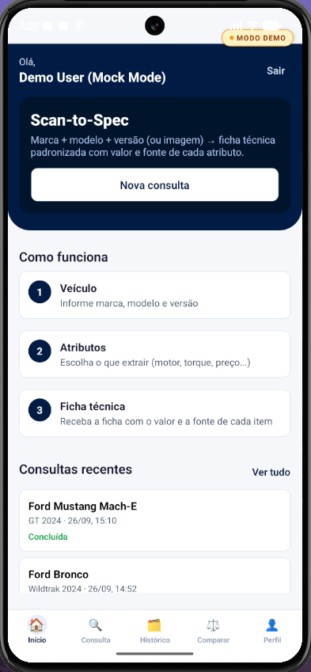
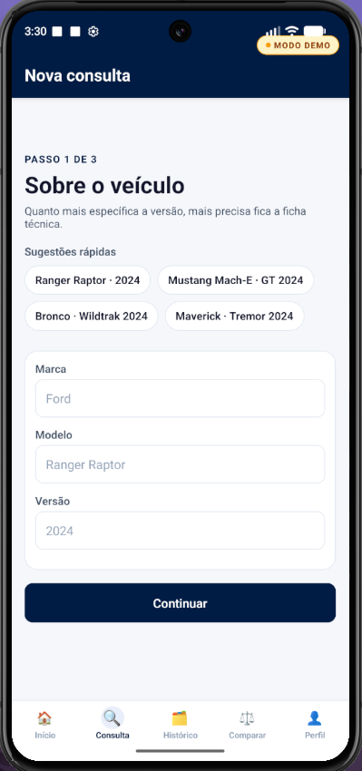
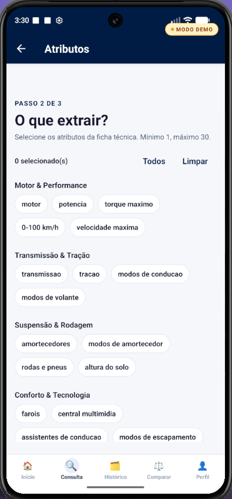
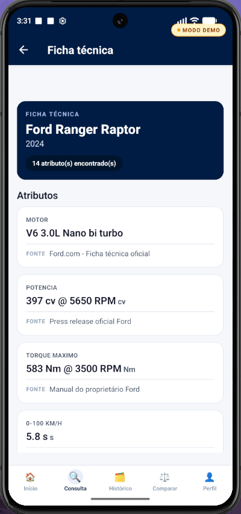
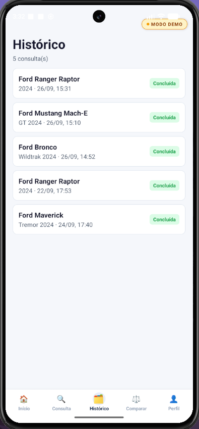
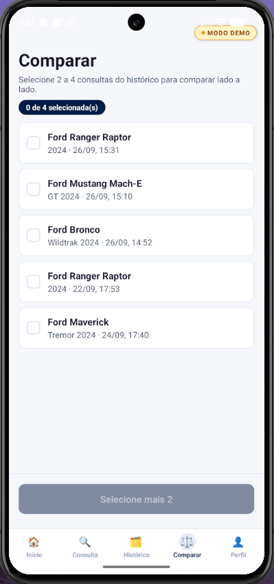
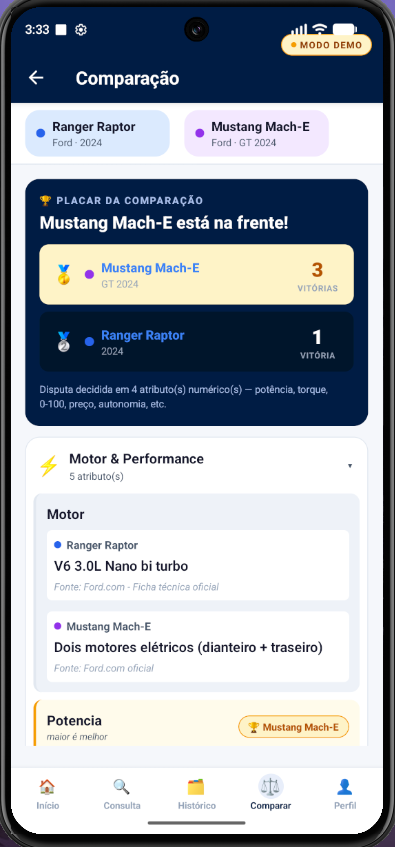
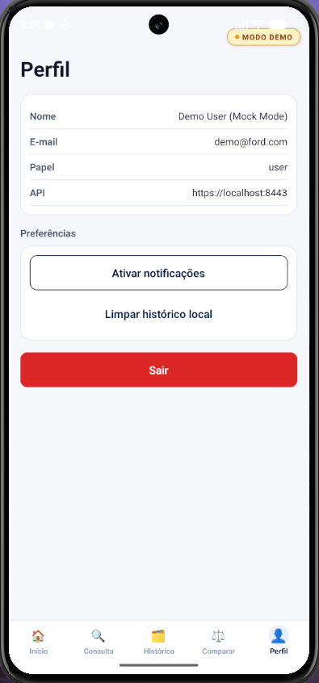

# Ford Scan-to-Spec — App Mobile

App mobile para a disciplina **Mobile Development & IoT** (FIAP — 3ESPY) no desafio Ford. 

**Objetivo:** o usuário informa **marca / modelo / versão**, escolhe os atributos desejados e recebe uma **ficha técnica padronizada** com **valor** e **fonte** de cada informação.

> 📌 **Este repositório contém apenas a aplicação mobile** (React Native + Expo). A **API REST é um projeto separado** (`Ford-api`) com deploy independente. O app apenas **consome** essa API.

## 📱 Demonstração Visual

Abaixo encontra-se a demonstração dos principais fluxos da aplicação.

<div align="center">
  
  &nbsp;&nbsp;&nbsp;
  
  &nbsp;&nbsp;&nbsp;
  
  &nbsp;&nbsp;&nbsp;
  
  &nbsp;&nbsp;&nbsp;
  
  &nbsp;&nbsp;&nbsp;
  
  &nbsp;&nbsp;&nbsp;
  
  &nbsp;&nbsp;&nbsp;
  
  &nbsp;&nbsp;&nbsp;
</div>


---

## 👥 Equipe

| Nome | RM |
|---|---|
| Milena Codinhoto da Silva | 554682 |
| Pedro Henrique Martins Alves dos Santos | 558107 |
| Felipe Cerboncini Cordeiro | 554909 |

---

## 🛠️ Stack Tecnológico

| Camada | Tecnologia |
|---|---|
| **Runtime** | React Native 0.81 + Expo SDK 54 |
| **Linguagem** | TypeScript 5.9 (strict mode) |
| **Navegação** | React Navigation (Native Stack + Bottom Tabs) |
| **Estado** | React Context (Auth + QueryDraft) |
| **HTTP** | axios com interceptor de JWT + refresh automático |
| **Storage seguro** | expo-secure-store (tokens JWT) |
| **Cache local** | @react-native-async-storage/async-storage (histórico) |
| **Notificações** | expo-notifications |
| **Configuração** | Variáveis de ambiente (`.env`) |

---

## 📱 Telas Implementadas

| Tela | Função | Arquivo |
|---|---|---|
| **Login** | Autenticação de usuário | `src/screens/auth/LoginScreen.tsx` |
| **Registro** | Onboarding de novos usuários | `src/screens/auth/RegisterScreen.tsx` |
| **Início** | Dashboard com consultas recentes | `src/screens/home/HomeScreen.tsx` |
| **Veículo** | Seleção de marca/modelo/versão | `src/screens/query/VehicleFormScreen.tsx` |
| **Atributos** | Seletor de quais dados extrair | `src/screens/query/AttributeSelectorScreen.tsx` |
| **Processando** | Status da extração em tempo real | `src/screens/query/ProcessingScreen.tsx` |
| **Ficha Técnica** | Resultado final (valor + fonte) | `src/screens/query/SpecSheetScreen.tsx` |
| **Histórico** | Consultas salvas localmente | `src/screens/history/HistoryListScreen.tsx` |
| **Comparação** | Multi-seleção e placar comparativo | `src/screens/compare/CompareSelectionScreen.tsx` e `CompareResultScreen.tsx` |
| **Perfil** | Sessão + permissões | `src/screens/profile/ProfileScreen.tsx` |

---

## 📋 Ficha Técnica — Valor + Fonte

Cada atributo retornado pela API vem com:
- `value` — valor numérico ou textual
- `available` — disponibilidade
- `normalized_unit` — unidade padrão
- `source_hint` — origem da informação

**Na ficha técnica:**
- ✅ Apenas atributos com dados reais são exibidos
- 📍 Cada card mostra **valor** + **fonte** de extração
- 📊 Atributos numéricos são comparáveis

---

## ⚡ Quick Start

### Pré-requisitos

- **Node 20+** (recomendado: 22 LTS)
- **npm** ou **yarn**
- **Expo Go** instalado no celular **OU** emulador configurado

### Instalação (5 minutos)

```bash
# Clone e instale
git clone <repo-url>
cd ford-mobile-app
npm install

# Configure as variáveis de ambiente
cp .env.example .env
```

Escolha um dos dois modos na próxima seção.

---

## 🚀 Como Rodar — Escolha Seu Modo

O app tem **duas formas de execução**, controladas por `EXPO_PUBLIC_MOCK_MODE` no `.env`:

### 🟢 MODO DEMO — Sem Backend (Recomendado para começar)

**Ideal para:** avaliar o app **sem depender da API**. Dados locais, **100% offline**.

#### Passo 1: Configurar `.env`
```env
EXPO_PUBLIC_MOCK_MODE=true
```

#### Passo 2: Iniciar
```bash
npx expo start --clear
```

#### Passo 3: Abrir
- **Celular:** escaneie o QR code no Expo Go
- **Web:** pressione `w` no terminal
- **Android:** pressione `a`
- **iOS:** pressione `i`

#### ✨ O que aparece
- Badge **"MODO DEMO"** amarelo no topo (indicador visual)
- **Qualquer e-mail/senha funciona** para login
- 4 Fords pré-carregados para testar:
  - Ranger Raptor 2024
  - Mustang Mach-E 2023
  - F-150 Lightning 2024
  - Ecosport Titanium 2023
- **Fluxo completo funciona:** ficha técnica, histórico, comparação, notificações

---

### 🔵 MODO REAL — Consumindo a API

**Ideal para:** testar integração verdadeira. **Requer o backend `Ford-api` rodando.**

#### Passo 1: Suba o Backend

No repositório **`Ford-api`** (projeto separado):
```bash
docker compose up
```

⏳ Aguarde ~30 segundos até ver `✓ All services started`.

#### Passo 2: Autorize o Certificado (⚠️ Obrigatório)

Como o certificado é **autoassinado**, você precisa criar uma exceção no navegador:

1. Abra numa aba do navegador:
   ```
   https://localhost:8443
   ```

2. Você verá o aviso *"Sua conexão não é privada"*
   - Clique em **Avançado**
   - Clique em **Continuar para localhost (não seguro)**

3. A página deve responder com:
   ```json
   {
     "service": "ford-api-gateway",
     "status": "ok",
     "mode": "dev-http"
   }
   ```

✅ **Pronto!** A exceção de segurança foi registrada no navegador.

#### Passo 3: Configurar `.env`
```env
EXPO_PUBLIC_MOCK_MODE=false
EXPO_PUBLIC_API_URL=https://localhost:8443
```

#### Passo 4: Iniciar o App
```bash
npx expo start --clear
```

#### Passo 5: Abrir no Navegador
```
Pressione "w" no terminal
```

**Verificação:** o badge "MODO DEMO" **não aparece** = app está consumindo a API real ✅

---

## ⚠️ Certificados & Erros Comuns

### Por que preciso autorizar o certificado?

A API usa **HTTPS com certificado autoassinado** (gerado localmente, sem autoridade certificadora). O navegador **bloqueia por padrão** — você precisa criar uma exceção.

### Problemas e Soluções

| Erro | Causa | Solução |
|---|---|---|
| `ERR_CERT_AUTHORITY_INVALID` | Navegador não confia no certificado | Abra `https://localhost:8443` e aceite (Passo 2) |
| `502 Bad Gateway` | Serviço nginx desatualizado | `docker compose restart nginx` no Ford-api |
| `Network Error` no app | Backend não respondeu | Teste: `curl -k https://localhost:8443` |
| Continua em "MODO DEMO" | Metro não releu `.env` | Pare o Metro e rode `npx expo start --clear` |
| `Connection refused` no celular | Rede não alcança localhost:8443 | Use **Modo Demo** ou backend com IP público |

### 📱 Testando no Celular Físico

**⚠️ Atenção:** certificados autoassinados **não funcionam** automaticamente em celulares físicos.

**Opções:**
1. **Use Modo Demo** ✅ (recomendado)
2. Use backend com certificado válido
3. Use IP da máquina + certificado válido

---

## 🔧 Arquivo `.env` — Variáveis de Ambiente

O `.env` fica na **raiz do projeto** e **não é versionado** (cada máquina tem o seu). O template é `.env.example`.

### Variáveis Disponíveis

| Variável | Valores | Descrição |
|---|---|---|
| `EXPO_PUBLIC_MOCK_MODE` | `true` / `false` | `true` = Modo Demo (dados locais); `false` = API real |
| `EXPO_PUBLIC_API_URL` | `auto`, `https://localhost:8443`, `http://IP:8080` | Endereço da API. `auto` detecta IP do host (HTTP porta 8080, modo LAN) |

### Exemplo de `.env`

```env
# Modo Demo (sem backend)
EXPO_PUBLIC_MOCK_MODE=true
EXPO_PUBLIC_API_URL=auto

# OU Modo Real (com backend)
EXPO_PUBLIC_MOCK_MODE=false
EXPO_PUBLIC_API_URL=https://localhost:8443
```

### ⚠️ Lembrete Importante

Sempre que **editar `.env`**, reinicie o Metro:
```bash
npx expo start --clear
```

As variáveis `EXPO_PUBLIC_*` são **embutidas no bundle** no momento do build.

---

## 📊 Fluxo de Uso (End-to-End)

```
┌─────────────┐
│   Login     │ → Qualquer credencial no Modo Demo
└──────┬──────┘
       ↓
┌─────────────────────┐
│   Tela Inicial      │ → Mostra últimas consultas (com cache offline)
└──────┬──────────────┘
       ↓
┌──────────────────────────────────────┐
│  Nova Consulta (3 passos)            │
├──────────────────────────────────────┤
│  1️⃣  Veículo                         │ → Marca, modelo, versão
│  2️⃣  Atributos                       │ → Selecione o que extrair
│  3️⃣  Processando                     │ → API trabalha + UI anima
└──────┬───────────────────────────────┘
       ↓
┌─────────────────────┐
│  Ficha Técnica      │ → Resultado com valor + fonte
└──────┬──────────────┘
       ↓
┌─────────────────────┐
│  Notificação Local  │ → "Ficha pronta!" (expo-notifications)
└──────┬──────────────┘
       ↓
┌─────────────────────────────────────┐
│  Comparação (opcional)              │ → Selecione 2-4 consultas
│  Placar Comparativo                 │ → Vencedor por atributo
└─────────────────────────────────────┘
```

---

## 🏆 Comparação de Veículos

A tela de comparação funciona como um **placar de competição**:

- **Cada atributo numérico** (potência, torque, 0-100 km/h, preço, autonomia…) tem um **vencedor** — quem tem o melhor valor leva 1 ponto.
- **Placar no topo** soma as vitórias e mostra ranking: 🥇 🥈 🥉
- **Cada card de atributo** destaca o vencedor (🏆), mostra valor + fonte de todos os veículos.
- **Atributos de texto** (motor, transmissão) são mostrados mas **não têm vencedor**.

---

## 📦 Estrutura do Projeto

```
ford-mobile-app/
│
├── App.tsx                         # Bootstrap + ErrorBoundary global
├── app.json                        # Configuração do Expo
├── package.json                    # Dependências
├── tsconfig.json                   # Config TypeScript
├── babel.config.js                 # Alias @/ → src/
├── .env / .env.example             # Variáveis de ambiente
│
└── src/
    ├── api/                        # 🌐 HTTP Client
    │   ├── axios.ts                # Instância axios + interceptor JWT
    │   ├── endpoints.ts            # Funções dos endpoints
    │   └── mocks.ts                # Dados simulados (Modo Demo)
    │
    ├── components/                 # 🎨 Componentes reutilizáveis
    │   ├── AppErrorBoundary.tsx    # Error boundary global
    │   └── [outros componentes]
    │
    ├── contexts/                   # 🔄 Estado Global
    │   ├── AuthContext.tsx         # Autenticação
    │   └── QueryDraftContext.tsx   # Rascunho da consulta
    │
    ├── navigation/                 # 🧭 Navegadores
    │   ├── AuthNavigator.tsx       # Fluxo login/registro
    │   ├── AppNavigator.tsx        # Fluxo logado (home, history, profile)
    │   ├── QueryNavigator.tsx      # Fluxo nova consulta
    │   ├── CompareNavigator.tsx    # Fluxo comparação
    │   └── RootNavigator.tsx       # Coordena tudo
    │
    ├── screens/                    # 📱 Telas
    │   ├── auth/                   # Login, Registro
    │   ├── home/                   # Dashboard
    │   ├── query/                  # Fluxo nova consulta
    │   ├── history/                # Histórico de consultas
    │   ├── compare/                # Comparação
    │   └── profile/                # Perfil do usuário
    │
    ├── storage/                    # 💾 Persistência
    │   ├── SecureStore.ts          # Tokens (seguro)
    │   └── AsyncStorage.ts         # Cache local (histórico)
    │
    ├── notifications/              # 🔔 Notificações
    │   └── NotificationService.ts  # Wrapper de expo-notifications
    │
    ├── theme/                      # 🎨 Design System
    │   ├── colors.ts               # Paleta de cores
    │   ├── spacing.ts              # Espaçamentos
    │   └── typography.ts           # Tipografia
    │
    ├── types/                      # 📘 TypeScript
    │   └── api.ts                  # Tipos das respostas da API
    │
    └── utils/                      # 🛠️ Funções Auxiliares
        ├── format.ts               # Formatação (números, moeda, etc)
        ├── compare.ts              # Lógica de comparação
        └── responsive.ts           # Helpers de responsividade
```

---

## 🌐 Endpoints Consumidos

Todos esperam **JWT no header** `Authorization: Bearer <token>` (exceto login/registro).

| Método | Path | Usado em | Autenticação |
|---|---|---|---|
| **POST** | `/auth/register` | RegisterScreen | ❌ Não |
| **POST** | `/auth/login` | LoginScreen | ❌ Não |
| **POST** | `/auth/refresh` | Interceptor axios | ✅ Sim (transparente) |
| **GET** | `/auth/me` | Bootstrap + ProfileScreen | ✅ Sim |
| **POST** | `/vehicles/query` | ProcessingScreen | ✅ Sim |
| **GET** | `/vehicles/queries` | HomeScreen, HistoryListScreen | ✅ Sim |
| **GET** | `/vehicles/queries/{id}` | SpecSheetScreen, HistoryDetail | ✅ Sim |

📄 Tipos das respostas em: [`src/types/api.ts`](src/types/api.ts)

---

## ✨ Diferenciais Entregues

- ✅ **Modo Demo offline** — app 100% funcional sem backend
- ✅ **Detecção automática de IP** da API (`EXPO_PUBLIC_API_URL=auto`)
- ✅ **Histórico local** com AsyncStorage + fallback offline
- ✅ **Notificações locais** ao concluir extração (expo-notifications)
- ✅ **Refresh automático de JWT** via interceptor axios
- ✅ **Atualização em time** nas telas Início e Histórico (`useFocusEffect`)
- ✅ **Comparação multi-veículo** (2-4) com placar e vencedor por atributo
- ✅ **ErrorBoundary global** — exceção em uma tela não derruba o app
- ✅ **Responsividade completa** — funciona em todos os tamanhos de tela

---

## 🎬 Roteiro de Demo (3-4 minutos)

**Cenário:** Rodando em **Modo Demo** (sem backend)

1. ✅ **App inicia** → vê a tela inicial com últimas consultas + badge "MODO DEMO"
2. ✅ **Nova consulta** → clica em "Nova consulta" ou toca em um preset (ex: "Ranger Raptor 2024")
3. ✅ **Seleção de atributos** → escolhe "Todos" ou atributos específicos
4. ✅ **Processando** → vê as etapas animadas da extração
5. ✅ **Ficha técnica** → mostra atributos com valor e fonte
6. ✅ **Comparação** → volta na aba "Comparar", seleciona 2-3 consultas, vê placar
7. ✅ **Histórico** → consulta fica salva e aparece na aba "Histórico"

**Tempo total:** ~3 minutos

---

## 📚 Scripts Úteis

### Development

```bash
npm start                    # Inicia Expo dev server
npx expo start --clear       # Reinicia + limpa cache (após editar .env)
npx expo start --tunnel      # Quando a rede local não coopera (ngrok tunnel)
```

### Emuladores

```bash
npm run android              # Abre no emulador Android
npm run ios                  # Abre no simulador iOS (macOS)
npm run web                  # Preview no navegador (web)
```

### Build & Verificação

```bash
npm run typecheck            # Verifica tipos TypeScript (tsc --noEmit)
npm run lint                 # ESLint (se configurado)
npm run build                # Produção (eas build, se configurado)
```

---

## 🐛 Troubleshooting

### Metro (dev server) está lento?

```bash
npx expo start --clear
```

### Mudei `.env` mas as variáveis não atualizaram?

Reinicie com `--clear`:
```bash
npx expo start --clear
```

### Certificado SSL dá erro mesmo após aceitar?

1. Abra `https://localhost:8443` novamente
2. Aceite o aviso
3. Reinicie o app no Expo

### App fica travado na tela de login?

- **Modo Demo:** qualquer email/senha entra
- **Modo Real:** verifique se o backend está rodando (`docker compose up` no Ford-api)

### Como saber se estou em Modo Demo ou Real?

- **Modo Demo:** badge **amarelo "MODO DEMO"** no topo 🟡
- **Modo Real:** **sem badge** = consumindo API

---

## 📖 Documentação Adicional

- **[Tipos da API](src/types/api.ts)** — Estrutura das respostas
- **[Configuração Expo](app.json)** — Metadados do app
- **[Arquivos de exemplo](.env.example)** — Template de variáveis

---

## 📞 Suporte

**Dúvidas ou problemas?**

1. Verifique a seção **Troubleshooting** acima
2. Confira se está seguindo o **Passo 2 (Certificado)** no Modo Real
3. Teste em **Modo Demo** primeiro (mais simples)

---

**Desenvolvido para FIAP — 3ESPY**
